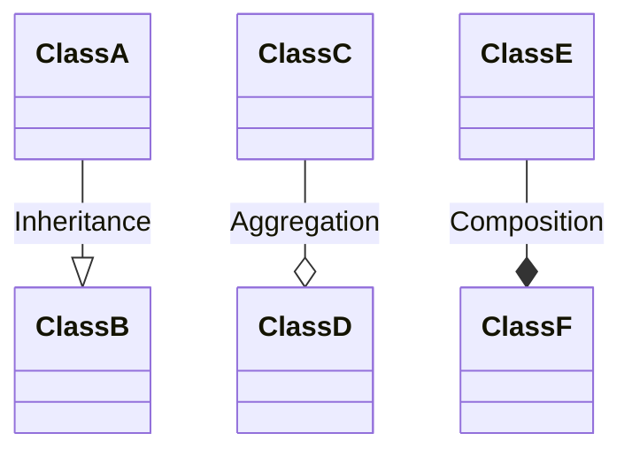
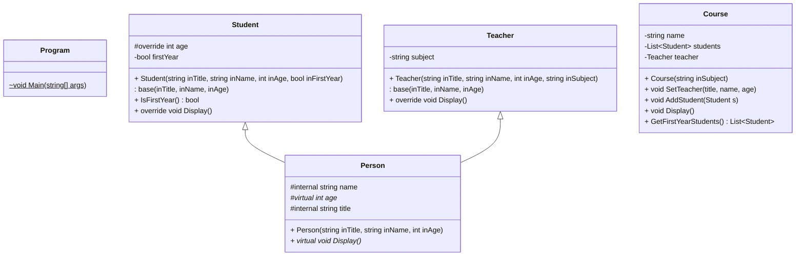

# L221 - OOP Recap Worksheet

### 1. What is the difference between a primitive variable and an object reference variable? 
Object reference variables are actually pointers to the address of the variable/location which the data is held in. For example, you can make an instance of an object reference variable, of a particular class object in C#.
```csharp
public class Person
{
    public string name;
    public int age;
}
static void Main()
{
    Person p1 = new Person();
    Person p2 = p1;
}
```
Here, `p2` is an object reference variable.\
So it’s not holding data, but is pointing to a different variable (the class) where all the data actually is. A primitive variable is simply the data, and it doesn’t refer to anything else.

### 2. What is the difference between an object and an object reference?
As shown in the code block, `p1` is an object, if `p1` gets released from memory, then that object will cease to exist and take any stored memory with it. But if `p2` is released from memory, then the object and all its data will still be in memory, but `p2` won’t point to `p1` anymore.

### 3. Explain what is meant by the following terms:
- Instantiation\
An instance of a class is first created.
- Encapsulation\
Restricting the access to certain data within a class
- Inheritance\
A child class can inherit methods and variables from their parent class. E.g. a square inherits the data of a rectangle.

### 4.	What is the difference between aggregation and composition?
- Aggregation\
Weak association. When the owning object is destroyed, the owned object still exists.
- Composition\
Strong association. The owned object would be destroyed alongside the owning.

### 5.	How are inheritance, aggregation and composition represented on a class diagram?


## Extension:
### 1.	What is meant by polymorphism?
Polymorphism is the idea of using a single identifier to resemble multiple different types of an entity, such as different variable types. An example would be an interface in C#, where there’s abstract methods and classes which can be modified or extended based on what the derived class is made to do.
### 2.	What is the difference between an abstract class and an interface?
Interfaces don’t have any state or implementation, they’re supposed to be a backbone to follow when creating a class; abstract classes may contain data and methods, so that when they’re derived they can have previously set implementations which is general for the abstract class. Like a student class derived from an abstract class person, which will always have a name or age, and the student can then add more implementations such as their course.
### 3.	Explain the object-oriented design principle “Encapsulate what varies”
This refers to the idea of isolating and separating areas of code, which may likely change in the future, so that once the changes are required, the implementation can be updated in a single place rather than having to refactor those changes throughout the code. 

## Programming:
1.	Import the L221 – Skeleton Program found on Google Classroom into a new Visual Studio project.
2.	Complete the [class diagram](ClassDiagram.cd) by adding the `Teacher` and `Course` classes:

3.	Make the following changes to the skeleton code:
    - [x] Add two methods to the `Person` class for modifying the Name and Age of the person. Make sure that the parameter for the SetAge method is between <samp>14</samp> and <samp>19</samp>.
    - [x] Add a protected attribute to the `Person` class for the Title of the person (e.g. "Ms, Mr, Dr, Mx"). Make any other necessary changes to other parts of the code.
    - [x] Override the Display method in the `Student` class so that it also displays whether the student is in first year or second year.
    - [x] Add a method to the `Course` class called `GetFirstYearStudents` which returns a `List<Student>`
    - [x] Amend the `Display` method in the `Course` class so that it first sorts the list of students by their Name. You will need to create an accessor method in `Person` for Name. You should implement the **Bubble Sort** algorithm for this task.